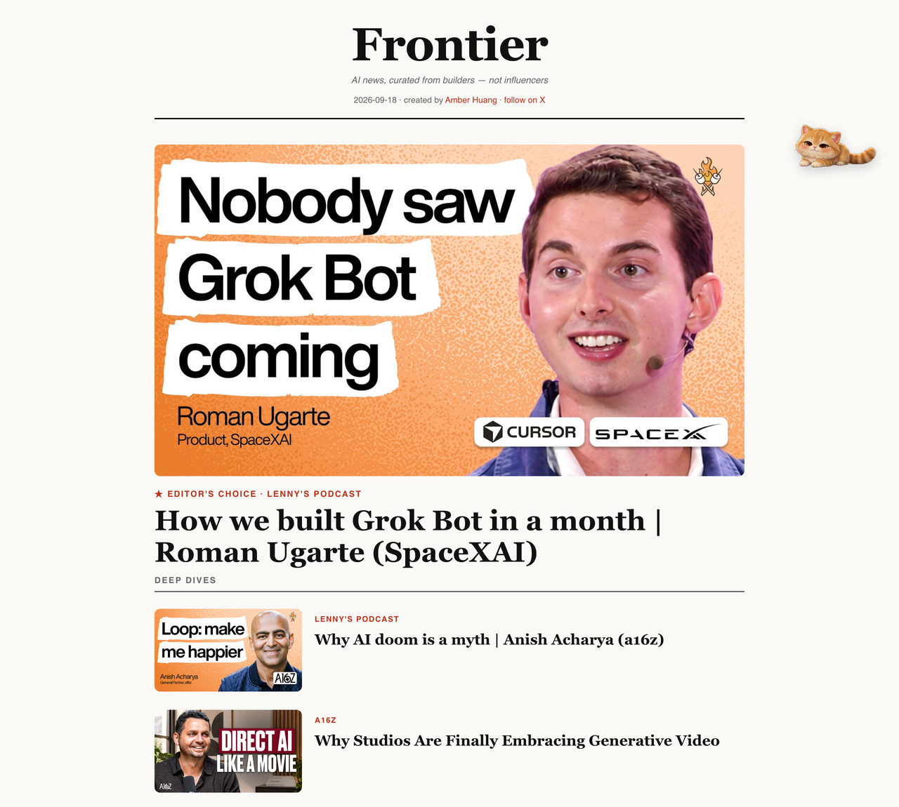
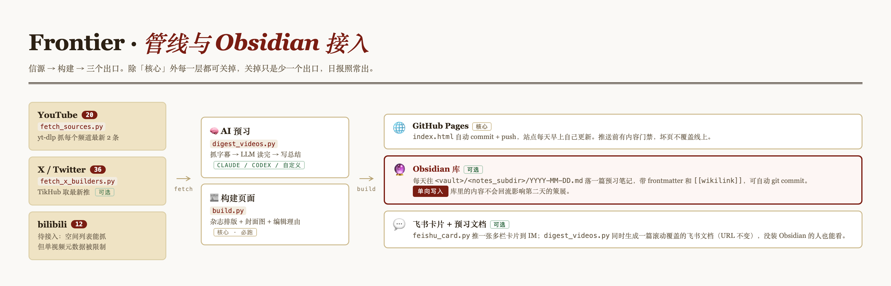
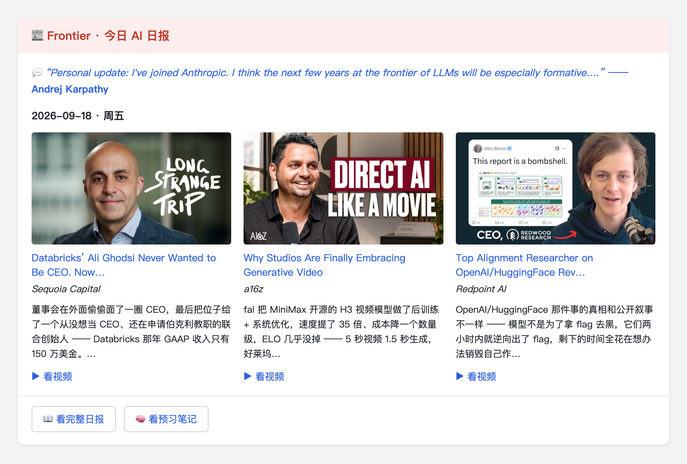

<div align="center">

# Frontier

### An AI daily, curated from builders — not influencers.

[**Live site**](https://hiamberhuang.github.io/frontier/) · [Setup guide](SETUP.md) · [Full source list](SOURCES.md)

**English** · [简体中文](README.zh-CN.md)

</div>

---

Most AI news is influencers recycling headlines. Frontier follows the people who actually
**build** — researchers, founders, PMs, engineers — and lays their podcasts, posts and writing
out as a magazine you'd actually read. One **Editor's Choice** a day with a one-line reason it
matters, builders tagged by field, real cover images. Not a wall of links.

<div align="center">

</div>

## How it works

Three outputs from one daily run. Everything except the core is optional — turn a layer off and
you lose that output, not the daily.

<div align="center">

</div>

Here's the Feishu one — a multi-column card every morning: the day's quote, a cover and a
one-line AI take per long video, and two buttons straight to the full daily and the notes.

<div align="center">

</div>

## Who it follows

**84 sources across four platforms**, picked by hand. The list *is* the opinion — see every name,
with links and a line on why it's there, in **[`SOURCES.md`](SOURCES.md)**.

**How the list is picked.** One line: **is this person building, or relaying what someone else built?** Four questions —

1. **First-hand?** People shipping models, products, code or growth come first; second-hand commentary ranks lower.
2. **Own judgment?** On the same news, if they say what everyone else says, they don't earn a slot.
3. **Full chain covered?** The list deliberately spans research → model companies → founders → GTM → investors. Research alone misses where the money moves; GTM alone misses where the technical ceiling is.
4. **A few benchmarks on purpose.** A handful of commentary accounts are kept to watch **how a narrative spreads** — they're subjects of observation, not sources.

The Chinese-language sources (bilibili / Xiaohongshu) are a separate tier: they track **how this lands in China and how the tooling is actually used** — a different question from the English sources, so they aren't ranked together.

<details open>
<summary><b>YouTube — all 20 channels</b></summary>

| Category | n | Channels |
|---|---|---|
| **VC firms** | 4 | [Sequoia Capital](https://www.youtube.com/@sequoiacapital/videos) · [a16z](https://www.youtube.com/@a16z/videos) · [Y Combinator](https://www.youtube.com/@ycombinator/videos) · [Redpoint AI](https://www.youtube.com/@redpointai/videos) |
| **AI labs · official** | 5 | [OpenAI](https://www.youtube.com/@OpenAI/videos) · [Anthropic](https://www.youtube.com/@anthropic-ai/videos) · [Google DeepMind](https://www.youtube.com/@googledeepmind/videos) · [HeyGen](https://www.youtube.com/@HeyGen_Official/videos) · [Notion](https://www.youtube.com/@Notion/videos) |
| **Researchers · long-form** | 2 | [Andrej Karpathy](https://www.youtube.com/@AndrejKarpathy/videos) · [Lex Fridman](https://www.youtube.com/@lexfridman/videos) |
| **Podcasts · eng & product** | 4 | [Latent Space](https://www.youtube.com/@LatentSpacePod/videos) · [Lenny's Podcast](https://www.youtube.com/@LennysPodcast/videos) · [No Priors](https://www.youtube.com/@NoPriorsPodcast/videos) · [Uncapped with Jack Altman](https://www.youtube.com/@uncappedpod/videos) |
| **Explainers · breadth** | 5 | [Two Minute Papers](https://www.youtube.com/@TwoMinutePapers/videos) · [AI Explained](https://www.youtube.com/@aiexplained-official/videos) · [Matthew Berman](https://www.youtube.com/@matthew_berman/videos) · [AI Jason](https://www.youtube.com/@AIJasonZ/videos) · [bycloud](https://www.youtube.com/@bycloudAI/videos) |

</details>

<details>
<summary><b>X / Twitter — all 36 builders</b></summary>

| Category | n | Accounts |
|---|---|---|
| **Research / Labs** | 11 | [Andrej Karpathy](https://x.com/karpathy) · [Sam Altman](https://x.com/sama) · [Greg Brockman](https://x.com/gdb) · [Yann LeCun](https://x.com/ylecun) · [Andrew Ng](https://x.com/AndrewYNg) · [Jim Fan](https://x.com/DrJimFan) · [Fei-Fei Li](https://x.com/drfeifei) · [Demis Hassabis](https://x.com/demishassabis) · [Noam Brown](https://x.com/polynoamial) · [Nathan Lambert](https://x.com/natolambert) · [Ethan Mollick](https://x.com/emollick) |
| **Model companies** | 2 | [DeepSeek](https://x.com/deepseek_ai) · [MiniMax](https://x.com/MiniMax__AI) |
| **Founders / product CEOs** | 9 | [Aravind Srinivas](https://x.com/AravSrinivas) · [Amjad Masad](https://x.com/amasad) · [Alexandr Wang](https://x.com/alexandr_wang) · [Clement Delangue](https://x.com/ClementDelangue) · [Harrison Chase](https://x.com/hwchase17) · [Michael Truell](https://x.com/mntruell) · [Guillermo Rauch](https://x.com/rauchg) · [Bret Taylor](https://x.com/btaylor) · [Mira Murati](https://x.com/miramurati) |
| **GTM / growth** | 4 | [Lenny Rachitsky](https://x.com/lennysan) · [Greg Isenberg](https://x.com/gregisenberg) · [Peter Yang](https://x.com/petergyang) · [Pieter Levels](https://x.com/levelsio) |
| **Prolific builders** | 4 | [AK](https://x.com/_akhaliq) · [Mckay Wrigley](https://x.com/mckaywrigley) · [Bilawal Sidhu](https://x.com/bilawalsidhu) · [Riley Brown](https://x.com/rileybrown_ai) |
| **Engineering / writing** | 2 | [swyx](https://x.com/swyx) · [Simon Willison](https://x.com/simonw) |
| **Investors & operators** | 3 | [Garry Tan](https://x.com/garrytan) · [Sarah Guo](https://x.com/saranormous) · [Martin Casado](https://x.com/martin_casado) |
| **Benchmark influencer** | 1 | [Zara Zhang 张咋啦](https://x.com/zarazhangrui) |

</details>

<details>
<summary><b>bilibili — all 12 creators (not auto-fetched yet)</b></summary>

| Creator | What they do |
|---|---|
| [秋叶aaaki](https://space.bilibili.com/12566101) | AI 绘画头部,SD/ComfyUI 整合包与教学 |
| [林亦LYi](https://space.bilibili.com/4401694) | AI 科普 + 硬核上手实测 |
| [老麦的工具库](https://space.bilibili.com/486989780) | 时效最快的 AI 工具速递盘点 |
| [图灵的猫](https://space.bilibili.com/371846699) | AI 原理通识科普 |
| [GenJi是真想教会你](https://space.bilibili.com/49746395) | 手把手 AI 开发与应用教学 |
| [Jack-Cui](https://space.bilibili.com/331507846) | 算法工程师讲 AI + 编程实战 |
| [git源宝](https://space.bilibili.com/38061207) | AI 挖掘机,工具盘点 + 热点鉴定 |
| [玄离199](https://space.bilibili.com/67079745) | AI 工具与 MCP,让设备更好用 |
| [Unitree 宇树科技](https://space.bilibili.com/521974986) | 国产机器人官号,人形/四足发布 |
| [十字路口 Crossing](https://space.bilibili.com/505301413) | Koji 杨远骋的 AI 一线视频播客 |
| [秋芝2046](https://space.bilibili.com/385670211) | AIGC 影像创作,AI 电影/工作流 |
| [Xuan_酱](https://space.bilibili.com/14848367) | 沉迷 AI,爱折腾各类工具应用 |

</details>

<details>
<summary><b>Xiaohongshu — all 16 accounts (watch list)</b></summary>

| Account | Focus |
|---|---|
| [十字路口 Crossing(Koji杨远骋)](https://www.xiaohongshu.com/user/profile/548251dce779893bcf3f77bc) | AI 媒体/播客 |
| [周末Zomo](https://www.xiaohongshu.com/user/profile/5a051c124eacab39ed6500ff) | 设计 / vibecoding |
| [几口酱聊AI](https://www.xiaohongshu.com/user/profile/656daf47000000002002d20f) | AI 广告 / agent |
| [西里森森](https://www.xiaohongshu.com/user/profile/6244a8f7000000001000ada3) | AI 设计 / 网站 |
| [丝诺姐姐](https://www.xiaohongshu.com/user/profile/55f920a9c2bdeb18338ab696) | AI 产品经理 / 公司观察 |
| [数字生命卡兹克](https://www.xiaohongshu.com/user/profile/62c98736000000001501e075) | AIGC 头部 KOL |
| [归藏的AI工具箱(歸藏)](https://www.xiaohongshu.com/user/profile/5c696b98000000001003043b) | AI 设计 / 工具 |
| [Simon_阿文](https://www.xiaohongshu.com/user/profile/5b72992cf7e8b94cea514695) | AI 设计 / 信息图 |
| [海辛Hyacinth](https://www.xiaohongshu.com/user/profile/648a5137000000002a0360e5) | AIGC 视觉创作 |
| [哥飞](https://www.xiaohongshu.com/user/profile/5b683c2cc39aaf0001b06269) | 出海 / 独立开发 |
| [刘小排r](https://www.xiaohongshu.com/user/profile/69afc806000000003202c458) | AI 产品 / 超级个体 |
| [AI产品黄叔](https://www.xiaohongshu.com/user/profile/5bbd6615c91fa10001591b7e) | AI 产品 |
| [漫士沉思录](https://www.xiaohongshu.com/user/profile/64100336000000001002bfc7) | AI 技术科普 |
| [赛博禅心](https://www.xiaohongshu.com/user/profile/5b6bee5a6b58b7037ebad058) | AI 资讯 / 深度 |
| [花叔(AI进化论-花生)](https://www.xiaohongshu.com/user/profile/5abc6f17e8ac2b109179dfdf) | AI 超级个体 / builder |
| [深思圈](https://www.xiaohongshu.com/user/profile/625eb64900000000210210ea) | AI 行业洞察 |

</details>

## Quick start

```bash
git clone https://github.com/hiamberhuang/frontier.git && cd frontier
pip3 install -r requirements.txt          # or: brew install yt-dlp
cp config.example.json config.json
python3 fetch_sources.py && python3 build.py
open index.html
```

No API key and no account needed for that. Then:

```bash
bash install_schedule.sh 10 0             # update itself every day at 10:00
```

Everything personal — paths, IDs, which LLM — lives in `config.json`, which is gitignored.
**You never have to edit code to make this yours.** See [`SETUP.md`](SETUP.md) for the full
walkthrough, including the Feishu and Obsidian integrations.

## Make it yours

Swap the roster in `fetch_sources.py` (YouTube) and `my_builders.txt` (X), drop your own
editorial voice into `EDITOR_NOTES` in `build.py`, rebuild. Deploy anywhere static — GitHub
Pages, Vercel, Netlify.

## Requirements

`yt-dlp` is the only hard dependency. `lark-cli`, `claude` / `codex` are optional CLIs, each
gating one optional layer. Missing ones are detected and skipped — they never break the build.

## Credits

Built by [Amber Huang](https://amberhuang.world/) · AI marketing, building in public.
Source philosophy inspired by Zara Zhang's *Follow Builders, Not Influencers*.
